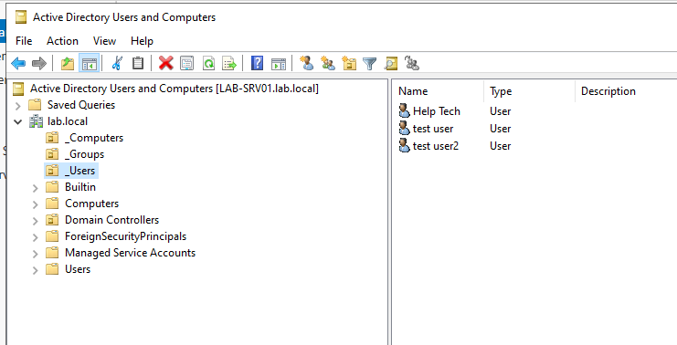
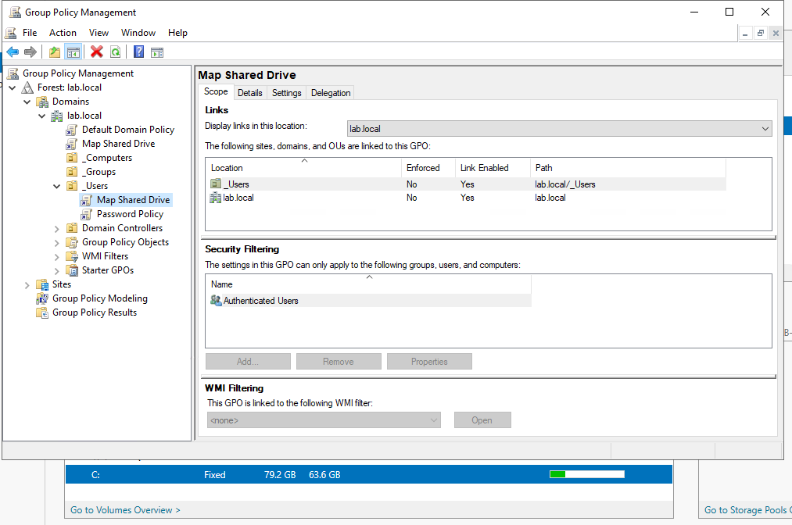
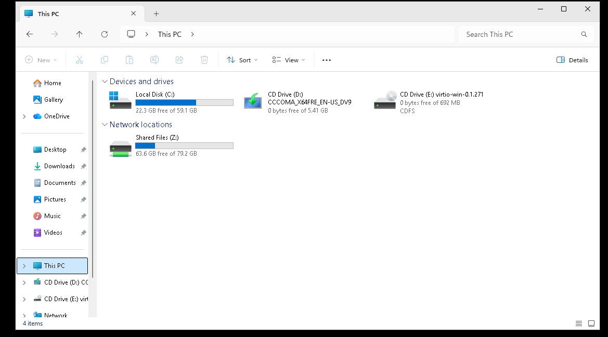
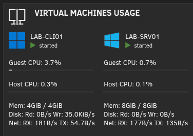
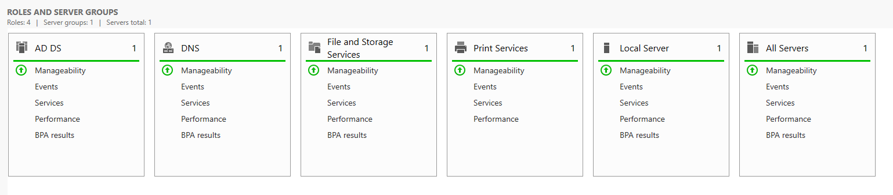

# 🧩 Project: Active Directory & GPO Lab

## 🗓️ Created: 2025-11-10  🆙 Last Updated: 2025-11-10  📈 Status: ✅ Completed

>This lab simulates a small **MSP client** environment with **Active Directory**, **Group Policy**, and **Remote Desktop Services**, covering common support workflows. It was built and documented for my portfolio and hands-on practice, not as a step-by-step guide.

---

### 🎯 Reason for This Project

I wanted to build a realistic small-business lab to strengthen my Active Directory and Windows Server skills.

- One Windows Server acting as a **Domain Controller, DNS**, and core services
- One Windows 11 client simulating an end-user workstation
- **Group Policies** for mapped drives, printers, RDP, and security baselines
- Realistic Tier 2 troubleshooting scenarios:
  - User creation, modification, and deactivation
  - Password resets and lockouts
  - Group membership management
  - Computer object management
  - Group Policy changes and enforcement testing

This lab serves as:

- A study environment for AD, GPO, and RDS
- A portfolio project to demonstrate MSP-level troubleshooting
- A reusable template for future Windows server labs

---

### 🥅 Goals

- ✅ Spin up a **Windows Server 2022 VM** and configure the `lab.local` domain
- ✅ Promote the server to a **Domain Controller** and enable DNS
- ✅ Spin up a **Windows 11 client VM** and join it to the domain
- ✅ Create **users, groups, and OUs** for role-based access
- ✅ Apply **Group Policies** for mapped drives, printers, RDP, and security baselines
- ✅ Test **RDP access** for helpdesk-style users
- ✅ Simulate and troubleshoot **printer mapping and GPO propagation issues**
- ❌ Add a dedicated **file server role** instead of hosting shares on the DC
- ❌ Add **monitoring/logging tools** (Sysmon, WEC) for deeper visibility
- ❌ Create **PowerShell automation scripts** for user creation, AD checks, and health verification
- ❌ Configure **DHCP** on the Windows Server (currently handled by my router)

---

### 🧾 Outcome

The lab’s fully up and running. Windows Server 2022 is handling **domain controller** duties, and a Windows 11 client is joined to the `lab.local` domain. **Active Directory**, **DNS**, and **Group Policy** are all working exactly the way they should.

User accounts and groups are set up to mimic helpdesk and end-user roles. Group Policies handle **mapped drives** and **shared printers** automatically. Login times are fast, replication’s consistent, and permissions behave just like they would in a real environment.

It’s stable, lightweight, and runs entirely on my Unraid server.

The setup mirrors a small business IT professional managing users, password resets, GPO hiccups, printer mapping issues, and RDP access problems. It’s contained, realistic, and gives me a safe place to break and fix things without touching production.

---

### 🧠 What I Learned

- **Active Directory** ties everything together with **DNS**, **authentication**, and **permissions** all working in sync
- **Group Policy** applies settings across users and computers, and can be fixed when it refuses to cooperate
- **RDP permissions** show why “Allow log on through Remote Desktop Services” isn’t as straightforward as it sounds
- **OU design** matters more than it seems, a clean structure saves hours of hunting later
- **Event Viewer** is useful when you stop guessing and start reading logs properly
- **Group Policy inheritance**, **precedence**, and **enforcement** interact in messy but predictable ways once you start layering policies
- **Lab environments** are the best place to break things on purpose and learn by fixing your own mistakes
- **Documenting configurations** as you go prevents the “what did I change again?” moments later
- **Simplicity** beats overly complicated setups every single time

---

### 🛠️ What I Did

- **Installed Windows Server 2022** as a virtual machine and configured the `lab.local` domain
- **Promoted the server to a Domain Controller** and enabled **DNS** for name resolution
- **Deployed a Windows 11 client** and successfully joined it to the domain
- **Created user and group accounts** to simulate helpdesk and end-user roles
- **Configured Organizational Units (OUs)** to separate servers, users, and computers for cleaner management
- **Built Group Policies (GPOs)** for mapped drives, shared printers, RDP access, and security settings
- **Tested Group Policy application** using `gpupdate` and `gpresult` to confirm proper policy enforcement
- **Simulated RDP access issues** and resolved them through group membership and policy adjustments
- **Verified printer/drive mapping and permissions** to ensure user-level functionality matched expectations

---

### ⚔️ What I Struggled With

- **Remote access configuration** required adding the helpdesk group to **Administrators** as a workaround to enable RDP connectivity
  - something you would **never** do in a live environment.
- **Group Policy inconsistencies** caused confusion when some policies didn’t apply immediately or appeared under different paths than expected
    - Windows seems to change the location of these paths occasionally during updates
- **Printer configuration** was tricky due to Microsoft locking down virtual/fake printers because of a vulnerability (known as `PrintNightmare`)
- **Event Viewer logs** took time to interpret properly, filtering and understanding event IDs wasn’t always straightforward
- **GPO replication delays** occasionally caused slow updates, making it unclear if a change failed or just hadn’t synced yet
  - I ran `gpupdate /force` constantly to keep the lab moving
- **Windows naming differences** between versions made this lab more difficult because settings and policies didn’t match older tutorials I found online

Despite these issues, everything eventually worked as intended, and troubleshooting these issues myself was the most valuable part in my opinion. Instead of simply following a guide, I had to actually figure things out.

---

### 📸 Screenshots / Results

Below are screenshots showing the final workflow and configuration.

#### 🗂️ Domain and OU Structure

This shows the `lab.local` domain I created and it's OUs

#### 🧭 GPO Drive Mapping

This shows the shared drive GPO and the drive appearing on the client machine.

#### 💻 System Overview

This shows the VMs running in the Unraid host, as well as showing the Roles and Server groups from the Server Manager Dashboard.

---

### 🔁 What I’d Do Differently

- Add another **Windows client** to test GPO behavior across multiple machines
- Use a **dedicated file server VM** instead of hosting shares on the Domain Controller
- Automate **user and group creation** with PowerShell instead of doing it manually
- Build a **health check script** to quickly verify DNS, GPO links, and RDP access
- Create new **troubleshooting scenarios** like password lockouts, DNS failures, and GPO inheritance issues

---

### 🪞 Personal Reflection

This lab was a great hands-on dive into Windows Server, Active Directory, DNS, domains, users, computers, Group Policy, shared drives, shared printers, and more.

The biggest challenge was how much Microsoft likes to move things around. Every guide I followed seemed to reference a slightly different version, and half the time the settings I needed were either renamed, relocated, or just gone completely.

Even with that, I really enjoyed building this. It set a solid foundation for future Windows Server training in my homelab and gave me a better appreciation for how all the pieces actually fit together.

---

### 🧱 Changelog

| Date       | Change                                        | Notes                                   |
| ---------- | --------------------------------------------- | --------------------------------------- |
| 2025-11-10 | Initial push                                  | Lab completed and ready for portfolio   |

---

### 🗂️ Related Links

- **[My GitHub Profile](https://github.com/StevenKearney)**
- **Related Projects (Planned):**
